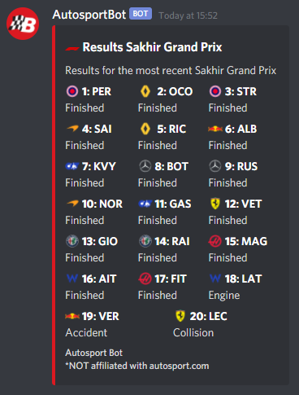
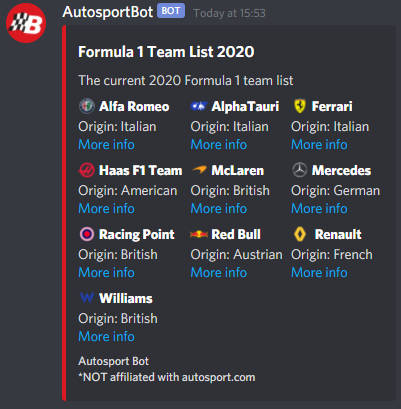

<h1 align="center" style="font-weight: bold">Autosport Bot</h1>

The Autosport discord bot utilizes web scraping and public API's to return specific racing data to users in discord. The bot is currently a work in progress and will be updated on a regular basis.

</img>

## Formula 1 Commands
Command prefix = `f1`

| Command           	| Output                                                                          	|
|-------------------	|---------------------------------------------------------------------------------	|
| `latestresults`   	| Lists the latest race results.                                                  	|
| `qualifying`      	| Lists the latest qualifying results with Q1, 2 & 3 lap times.                   	|
| `driverstandings` 	| Lists the current driver standings.                                             	|
| `teamstandings`   	| List the current constructor standings.                                         	|
| `calendar`        	| Lists the current formula 1 calendar.                                           	|
| `drivers`         	| Lists the current drivers that are on the grid.                                 	|
| `teams`           	| Lists the current constructors racing for the year.                             	|
| `team`            	| Query a specific constructor's information past or present.  `!team mercedes` 	|
| `driver`          	| Query a specific driver's information past or present.  `!driver hamilton`    	|
| `gif`             	| Get a random f1 gif in response, just for fun!                                  	|

## Response Examples

